## About

Software Engineer at **Flagstone International**, building fintech systems that move real money safely. I work across the full stack: high-throughput back-end services in C# and ASP.NET Core, modern front ends in Angular and React, and cloud infrastructure on Azure and AWS.

- <!--YEARS-->12<!--/YEARS-->+ years shipping production software on the .NET platform
- Strong focus on clean architecture, API design, and code that stays maintainable at scale
- Multi-cloud experience across Azure, AWS, and GCP
- I write about software engineering and web development on my [blog](https://gaganbodduluru.com)

## Tech Stack

| | |
|---|---|
| **Back End** |     |
| **Front End** |     |
| **Cloud** |    |
| **Data** |   |
| **DevOps** |     |

## Currently

- Building deposit platform services at Flagstone
- Going deeper on modern front-end frameworks and cloud-native architecture
- Writing technical posts, most recently on Next.js, MDX, and developer experience

## Connect

The best way to reach me is [LinkedIn](https://www.linkedin.com/in/bgagan4/). For my writing and projects, visit [gaganbodduluru.com](https://gaganbodduluru.com).

<!--
bgagan4/bgagan4 is a special repository: this README.md appears on the GitHub profile page.
-->
